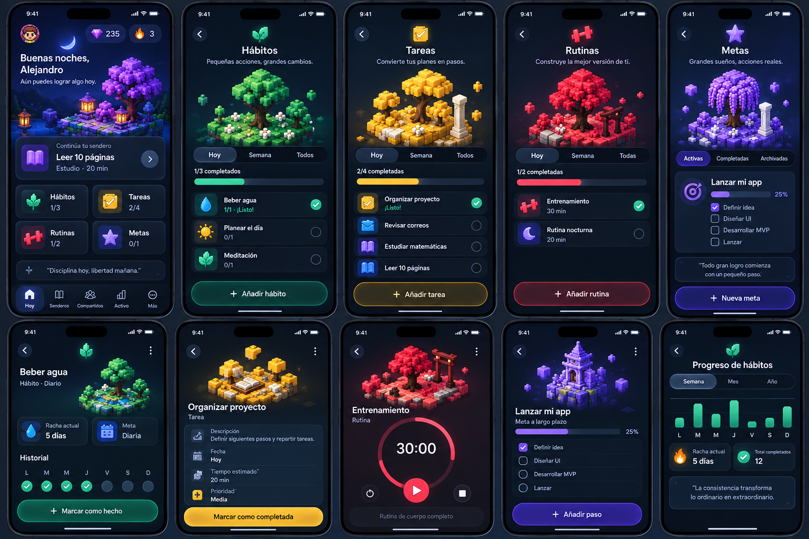
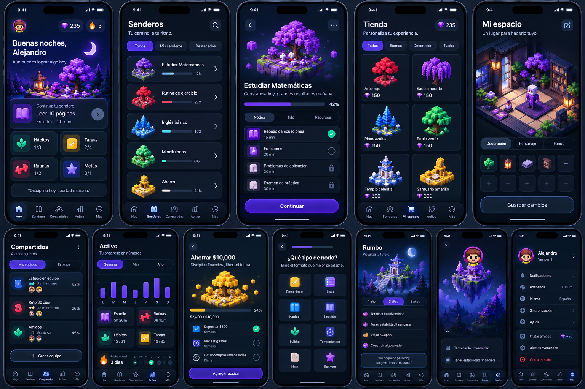

<p align="center">
  
</p>

<h1 align="center">
  
</h1>

<p align="center">
  <b>ES:</b> App móvil de hábitos y estudio gamificada, con un guía de IA (Aby), progresión por "senderos" y monetización con RevenueCat.<br/>
  <b>EN:</b> A gamified habit-building and study app for iOS/Android with an AI guide (Aby), progression "paths" (Senderos) and RevenueCat-powered monetization.
</p>

<p align="center">
  
  
  
  
</p>

<p align="center">
  <!-- TODO: reemplazar con el link publico de TestFlight (App Store Connect -> TestFlight -> External Testing -> Public Link) -->
  <a href="#"><b>📲 Probar en TestFlight</b></a>
</p>

Lestinaty convierte hábitos diarios en un mapa de progreso: cada hábito es un **sendero** de niveles, cada día cumplido avanza un nodo, y los hitos otorgan **cofres** y **gemas**. **Aby**, un agente conversacional con Gemini, ayuda a crear senderos personalizados a partir de una meta.

## Capturas

<p align="center">
  
</p>
<p align="center">
  
</p>

## Qué hace (what it does)

| Área | Descripción | Código |
|---|---|---|
| **Hoy / Hábitos** | Crear, registrar y gestionar hábitos con niveles progresivos, recordatorios y widgets. | `src/modulos/habitos`, `src/modulos/hoy` |
| **Senderos** | Mapa de progreso por hábito/meta (mandalas, nodos, cofres intermedios y finales). | `src/modulos/senderos` |
| **Aby (IA)** | Chat guiado que propone un sendero; Gemini se llama **solo** desde una Edge Function, nunca desde el cliente. _(En desarrollo: no está activo en este build de evaluación.)_ | `src/modulos/aby`, `supabase/functions/generar-sendero-aby` |
| **Tienda de gemas** | Paquetes IAP vía RevenueCat; las gemas se acreditan solo tras el webhook verificado. | `src/modulos/tienda`, `supabase/functions/recibir-webhook-revenuecat` |
| **Horizon (Pro)** | Suscripción con entitlement `horizon` (RevenueCat) que desbloquea la galería de widgets. | `src/nucleo/compras`, `src/plataforma/compras` |
| **Recordatorios** | Cola privada + OneSignal; el permiso se pide solo de forma contextual. | `supabase/functions/despachar-recordatorios-habitos` |
| **Privacidad** | Eliminación real de cuenta, consentimiento por permisos, RLS en todas las tablas personales. | `docs/app-store/privacy-inventory.md`, `supabase/privacidad-schema.md` |

## Stack

Expo SDK 57 · React Native 0.86 · expo-router · TypeScript · Zustand · TanStack Query · Skia/Reanimated (animaciones) · i18next (ES/EN) · Supabase (Postgres + RLS + Edge Functions) · RevenueCat · OneSignal · Gemini.

## Arquitectura

```text
app/            Rutas (expo-router): (publico) auth/intro, (principal) tabs, habitos/, senderos/, tienda/
src/modulos/    Dominio por funcionalidad (habitos, senderos, aby, tienda, acceso, ...)
src/nucleo/     Arranque, navegación, proveedores, compras, notificaciones
src/plataforma/ Adaptadores iOS/Android (auth, compras, notificaciones, widgets)
src/servicios/  Supabase, consultas, analítica, i18n, pagos
src/diseno/     Sistema de diseño (tema, componentes, iconos)
modules/        Módulo nativo del widget de hábitos
supabase/       Migraciones SQL, Edge Functions y smoke tests
docs/           Diseños, planes, checklist de release y notas de App Store
```

Decisiones clave de seguridad (detalle en [`supabase/resumen.md`](supabase/resumen.md)):

- Schemas separados `public` / `privacidad` / `comercio`; solo `public` está expuesto a la app.
- Las funciones nunca reciben `usuario_id` del cliente: derivan identidad de `auth.uid()`.
- Escrituras sensibles (gemas, progreso de hábitos) son RPC transaccionales e idempotentes; `acreditar_gemas` es exclusivo de `service_role`.
- Ningún secreto en el cliente: `scripts/validar-entorno-release.mjs` falla el build si detecta uno.

## Ejecutar en local (judges: quick start)

Requisitos: Node 20+, y Xcode (iOS) o Android Studio (Android). La app usa módulos nativos (Skia, RevenueCat, OneSignal, widget), por lo que **no corre en Expo Go**: hay que compilar un dev client.

```bash
npm install
cp .env.judges .env        # variables públicas ya preparadas para evaluación
npm run typecheck && npm test
npm run ios                # o: npm run android  (compila el dev client y abre la app)
# alternativa en la nube: npx eas build --profile ios-simulator --platform ios
```

- `.env.judges` contiene solo identificadores **públicos** de cliente (URL y anon key de Supabase protegida por RLS, claves públicas de RevenueCat). Los secretos de backend (Gemini, service-role, OneSignal REST, webhook) viven en Supabase Secrets y nunca están en el repo; `scripts/validar-entorno-release.mjs` falla el build si detecta alguno.
- Las compras usan el **modo sandbox** de RevenueCat/App Store; no se realiza ningún cargo real.
- Las credenciales de la cuenta demo se entregan en el formulario de envío (no se versionan). También se puede crear una cuenta nueva desde la pantalla de registro.

## Guía para jueces (judge guide)

Flujo principal sugerido (≈ 2 min): **Hoy → abrir un hábito → completar su nodo → Senderos muestra la progresión.**

- **Monetización (RevenueCat):** Tienda → Gemas (consumibles, en iOS y Android) y Perfil → Membresía (Horizon, hoy solo Android porque desbloquea widgets). Detalle técnico en [`docs/integracion-revenuecat.md`](docs/integracion-revenuecat.md).
- **Cofres:** se ganan por progreso, no se compran ni consumen gemas.
- Notas completas de revisión: [`docs/app-store/review-notes-en.md`](docs/app-store/review-notes-en.md).

## Documentación

- [`docs/integracion-revenuecat.md`](docs/integracion-revenuecat.md): **integración con RevenueCat** (gemas, Horizon, webhook, seguridad, cómo probar).
- [`docs/release/release-checklist.md`](docs/release/release-checklist.md): gate P0/P1 con evidencia.
- [`docs/superpowers/specs`](docs/superpowers/specs) y [`plans`](docs/superpowers/plans): diseño y plan de cada funcionalidad.
- [`supabase/`](supabase): esquema, migraciones y Edge Functions (cada una con su README).
- [`docs/legal/aviso-de-privacidad.md`](docs/legal/aviso-de-privacidad.md)

## Estado

Pre-lanzamiento. Backend verificado contra Supabase real; pendientes de acción externa (productos IAP en App Store Connect, APNs, matriz en dispositivos físicos) listados en el release checklist.

## Licencia

[Business Source License 1.1](LICENSE) (BUSL-1.1). El código es público para que RevenueCat y los jueces de Shipaton 2026 puedan ver, clonar, compilar y correr la app únicamente para evaluar esta postulación (ver el "Additional Use Grant" en [`LICENSE`](LICENSE)). Cualquier otro uso requiere permiso escrito de Lestinaty. No es open source bajo la definición de OSI; la licencia convierte a GPLv2+ por versión, 4 años después de cada publicación.
