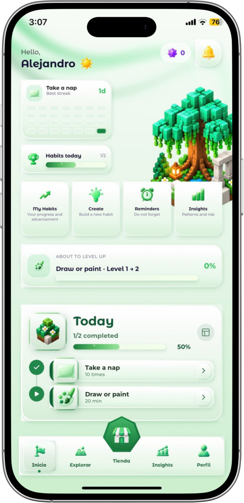
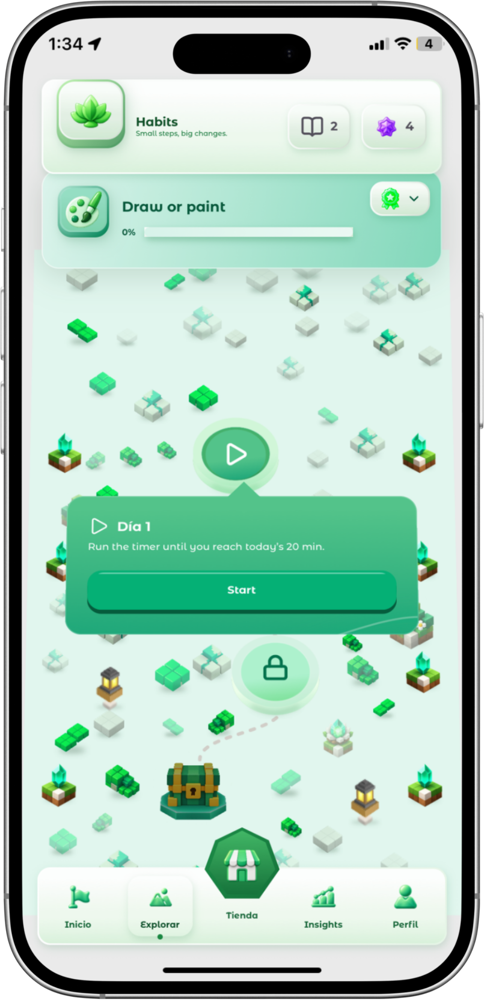
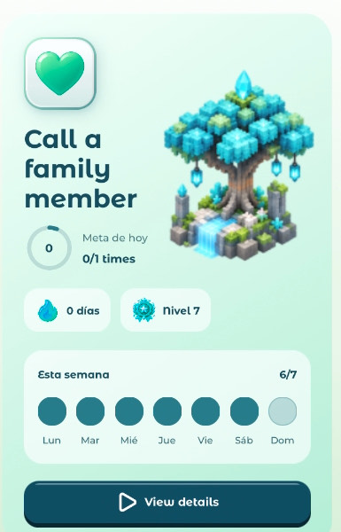
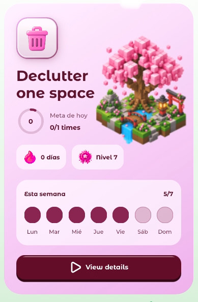
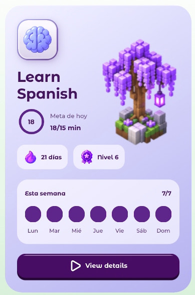
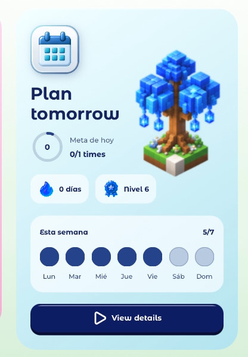
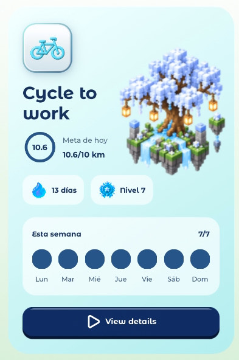

<p align="center">
  
</p>

<h1 align="center">
  
</h1>

<p align="center">
  A gamified habit-building and study app for iOS/Android with an AI guide (Aby), progression "paths" (Senderos) and RevenueCat-powered monetization.<br/>
  <sub><b>ES:</b> App móvil de hábitos y estudio gamificada, con un guía de IA (Aby), progresión por "senderos" y monetización con RevenueCat.</sub>
</p>

<p align="center">
  
  
  
  
</p>

<p align="center">
  <!-- TODO: replace with the public TestFlight link (App Store Connect -> TestFlight -> External Testing -> Public Link) -->
  <a href="#"><b>📲 Try it on TestFlight</b></a>
</p>

Lestinaty turns daily habits into a progress map: every habit is a **Sendero** (path) of levels, every day completed advances a node, and milestones award **chests** and **gems**. **Aby**, a Gemini-powered conversational agent, helps build a personalized path from a goal.

## Screenshots

<p align="center">
  
  
</p>

<p align="center">
  
  
  
  
  
</p>

## What it does

| Area | Description | Code |
|---|---|---|
| **Today / Habits** | Create, log, and manage habits with progressive levels, reminders, and widgets. | `src/modulos/habitos`, `src/modulos/hoy` |
| **Senderos (Paths)** | Progress map per habit/goal (mandalas, nodes, mid and final chests). | `src/modulos/senderos` |
| **Aby (AI)** | Guided chat that proposes a path; Gemini is called **only** from an Edge Function, never from the client. _(Work in progress: not active in this evaluation build.)_ | `src/modulos/aby`, `supabase/functions/generar-sendero-aby` |
| **Gem store** | IAP packs via RevenueCat; gems are credited only after the verified webhook fires. | `src/modulos/tienda`, `supabase/functions/recibir-webhook-revenuecat` |
| **Horizon (Pro)** | Subscription with a `horizon` entitlement (RevenueCat) that unlocks the widget gallery. | `src/nucleo/compras`, `src/plataforma/compras` |
| **Reminders** | Private queue + OneSignal; permission is requested only contextually. | `supabase/functions/despachar-recordatorios-habitos` |
| **Privacy** | Real account deletion, per-permission consent, RLS on every personal table. | `docs/app-store/privacy-inventory.md`, `supabase/privacidad-schema.md` |

## Stack

Expo SDK 57 · React Native 0.86 · expo-router · TypeScript · Zustand · TanStack Query · Skia/Reanimated (animations) · i18next (ES/EN) · Supabase (Postgres + RLS + Edge Functions) · RevenueCat · OneSignal · Gemini.

## Architecture

```text
app/            Routes (expo-router): (public) auth/intro, (main) tabs, habitos/, senderos/, tienda/
src/modulos/    Domain by feature (habitos, senderos, aby, tienda, acceso, ...)
src/nucleo/     Bootstrapping, navigation, providers, purchases, notifications
src/plataforma/ iOS/Android adapters (auth, purchases, notifications, widgets)
src/servicios/  Supabase, queries, analytics, i18n, payments
src/diseno/     Design system (theme, components, icons)
modules/        Native module for the habits widget
supabase/       SQL migrations, Edge Functions, and smoke tests
docs/           Designs, plans, release checklist, and App Store notes
```

Key security decisions (details in [`supabase/resumen.md`](supabase/resumen.md)):

- Separate `public` / `privacidad` / `comercio` schemas; only `public` is exposed to the app.
- Functions never receive `usuario_id` from the client: identity is derived from `auth.uid()`.
- Sensitive writes (gems, habit progress) are transactional, idempotent RPCs; `acreditar_gemas` is `service_role`-only.
- No secrets on the client: `scripts/validar-entorno-release.mjs` fails the build if it detects one.

## Run it locally (judges: quick start)

Requirements: Node 20+, and Xcode (iOS) or Android Studio (Android). The app uses native modules (Skia, RevenueCat, OneSignal, widget), so it **does not run in Expo Go**: you need to build a dev client.

```bash
npm install
cp .env.judges .env        # public variables already prepared for evaluation
npm run typecheck && npm test
npm run ios                # or: npm run android  (builds the dev client and opens the app)
# cloud alternative: npx eas build --profile ios-simulator --platform ios
```

- `.env.judges` contains only **public** client identifiers (Supabase URL and anon key, protected by RLS; public RevenueCat keys). Backend secrets (Gemini, service-role, OneSignal REST, webhook) live in Supabase Secrets and are never in the repo; `scripts/validar-entorno-release.mjs` fails the build if it detects one.
- Purchases use RevenueCat/App Store **sandbox mode**; no real charge is made.
- Demo account credentials are provided in the submission form (not versioned). You can also create a new account from the sign-up screen.

## Judge guide

Suggested main flow (~2 min): **Today → open a habit → complete its node → Senderos shows the progression.**

- **Monetization (RevenueCat):** Store → Gems (consumables, on iOS and Android) and Profile → Membership (Horizon, Android-only today because it unlocks widgets). Technical detail in [`docs/integracion-revenuecat.md`](docs/integracion-revenuecat.md).
- **Chests:** earned through progress, never purchased or paid for with gems.
- Full review notes: [`docs/app-store/review-notes-en.md`](docs/app-store/review-notes-en.md).

## Documentation

- [`docs/integracion-revenuecat.md`](docs/integracion-revenuecat.md): **RevenueCat integration** (gems, Horizon, webhook, security, how to test).
- [`docs/release/release-checklist.md`](docs/release/release-checklist.md): P0/P1 gate with evidence.
- [`docs/superpowers/specs`](docs/superpowers/specs) and [`plans`](docs/superpowers/plans): design and plan for each feature.
- [`supabase/`](supabase): schema, migrations, and Edge Functions (each with its own README).
- [`docs/legal/aviso-de-privacidad.md`](docs/legal/aviso-de-privacidad.md)

## Status

Pre-launch. Backend verified against the real Supabase project; pending external actions (IAP products in App Store Connect, APNs, testing on a physical device matrix) are listed in the release checklist.

## License

[Business Source License 1.1](LICENSE) (BUSL-1.1). The code is public so RevenueCat and Shipaton 2026 judges can view, clone, build, and run the app solely to evaluate this submission (see the "Additional Use Grant" in [`LICENSE`](LICENSE)). Any other use requires Lestinaty's written permission. Not open source under the OSI definition; the license converts to GPLv2+ per version, 4 years after each release.
