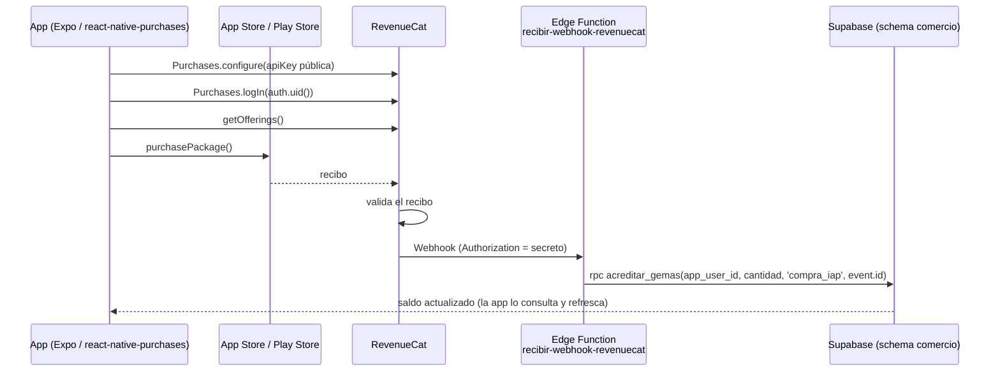

# Integración con RevenueCat

Lestinaty usa **RevenueCat** para todas las compras dentro de la app: paquetes de gemas (consumibles) y la suscripción **Lestinaty Horizon** (Pro). Este documento describe cómo funciona, dónde está el código y cómo verificarlo.

> Principio de diseño: **el cliente nunca decide qué se acredita.** La app solo inicia la compra; las gemas se otorgan únicamente cuando RevenueCat valida el recibo con la tienda y avisa a nuestro backend por webhook.

## Qué se vende

| Producto | Tipo | Identificador | Efecto |
|---|---|---|---|
| Gemas 100 / 550 / 1200 | Consumible (IAP) | iOS: `com.lestinaty.app.gemas.100`, `.550`, `.1200` | Acredita 100 / 550 / 1200 gemas |
| Lestinaty Horizon | Suscripción mensual | Entitlement `horizon` | Desbloquea la galería de widgets de hábitos |

Las gemas se gastan en la tienda de la app. Los **cofres** del progreso nunca se compran ni consumen gemas.

## Arquitectura

1. **Inicialización** (`inicializarCompras`): configura el SDK con la clave pública de la plataforma (`EXPO_PUBLIC_REVENUECAT_APPLE_KEY` / `_GOOGLE_KEY`). Sin clave no rompe la app; queda en estado `no_configurada`.
2. **Identidad:** al iniciar sesión se llama `Purchases.logIn(usuario.id)`. El `app_user_id` de RevenueCat **es el `auth.uid()` de Supabase**, y así el webhook sabe a quién acreditar. Al cerrar sesión se llama `logOut()`.
3. **Catálogo:** se leen los *packages* de la offering `current`. Los de gemas son de tipo `CUSTOM` y Horizon es `MONTHLY`; la pantalla muestra el precio localizado (`priceString`) que entrega la tienda.
4. **Compra:** `comprarPaquete` distingue cuatro resultados (`completada`, `cancelada`, `pendiente`, `error`). Solo `completada` refresca el saldo. Una compra cancelada no muestra error y una pendiente (por ejemplo, Ask to Buy) no acredita nada.
5. **Acreditación (servidor):** la Edge Function `recibir-webhook-revenuecat` recibe el evento y llama a `acreditar_gemas` con `service_role`. La app refresca el saldo al terminar la compra y otra vez 4 segundos después, porque el webhook puede tardar unos instantes.
6. **Horizon:** el acceso se decide leyendo `customerInfo.entitlements.active['horizon']` (`obtenerEstadoHorizon`).
7. **Restaurar compras:** `restaurarCompras` ejecuta `Purchases.restorePurchases()` y solo habla de Horizon; los consumibles no se restauran.

## Seguridad y consistencia

- **Webhook autenticado:** la función exige el header `Authorization` con un secreto (`REVENUECAT_WEBHOOK_SECRET`, guardado en Supabase Secrets). Sin él responde `401`. Se despliega con `--no-verify-jwt` porque la autenticación es ese secreto.
- **Idempotencia:** se usa el `event.id` de RevenueCat como referencia única en el ledger (`comercio.movimientos_gemas`). Un reintento del mismo webhook nunca acredita dos veces.
- **El cliente no puede acreditar:** `acreditar_gemas` está reservada a `service_role`; `comercio` no está expuesto a la API y la app no tiene ningún camino de escritura sobre las gemas.
- **Producto resuelto en servidor:** el `product_id` del evento se busca en `public.paquetes_gemas_iap_productos` (por plataforma) y la cantidad sale de `paquetes_gemas_iap`. Nada de lo que envía el cliente influye en cuántas gemas se dan.
- **Solo eventos relevantes:** `INITIAL_PURCHASE` y `NON_RENEWING_PURCHASE` acreditan; el resto (cancelaciones, expiraciones, `TEST`) devuelve `200` sin acción para evitar reintentos.
- **Sin secretos en el cliente:** la app solo contiene la clave pública de RevenueCat. `scripts/validar-entorno-release.mjs` falla el build si detecta cualquier secreto de backend.

## Dónde está el código

| Responsabilidad | Archivo |
|---|---|
| Cliente RevenueCat (único archivo que importa `react-native-purchases`) | `src/plataforma/compras/cliente.native.ts` |
| Contrato de tipos del dominio de compras | `src/plataforma/compras/contrato.ts` |
| Fachadas y estado de Horizon | `src/nucleo/compras/` |
| Identidad (`logIn` / `logOut`) | `src/modulos/acceso/proveedor/ProveedorAcceso.tsx` |
| Tienda de gemas | `src/modulos/tienda/` |
| Paywall de Horizon | `src/modulos/habitos/pantallas/HorizonPaywallPantalla.tsx` |
| Webhook | `supabase/functions/recibir-webhook-revenuecat/` |
| Catálogo y ledger | `supabase/migrations/*_gemas_*`, `*_productos_iap_*` y `supabase/comercio-schema.md` |
| Pruebas | `src/plataforma/compras/cliente.native.test.ts`, `src/nucleo/compras/*.test.ts`, `supabase/tests/08_productos_iap_plataforma.sql` |

## Cómo probarlo (sandbox)

- Las compras de TestFlight y de builds de desarrollo se hacen en **sandbox**: no hay cargos reales.
- **iOS:** Tienda → Gemas → elegir un paquete → confirmar con la hoja de compra de Apple. El saldo debe aumentar en unos segundos. Si no aparece al instante, es el webhook: espera y vuelve a abrir la pantalla.
- **Cancelar** la hoja de pago no muestra error y no cambia el saldo.
- **Android:** además de gemas, Perfil → Membresía abre el paywall de Horizon (precio, renovación automática, Restaurar, Gestionar suscripción, Términos y Privacidad).
- Pruebas automáticas: `npm test` (cubre el cliente de compras y el estado de Horizon).

## Alcance actual

- **iOS:** gemas (consumibles) y el flujo completo de acreditación por webhook.
- **Android:** gemas y Horizon. Hoy Horizon desbloquea únicamente los widgets, que existen solo en Android; por eso no se ofrece en iOS (`src/plataforma/capacidades.ts`), para no vender una suscripción sin un beneficio real en esa plataforma.
- El primer ciclo de revisión de App Store Connect y de las claves de producción es externo al repo (ver `docs/release/release-checklist.md`).
